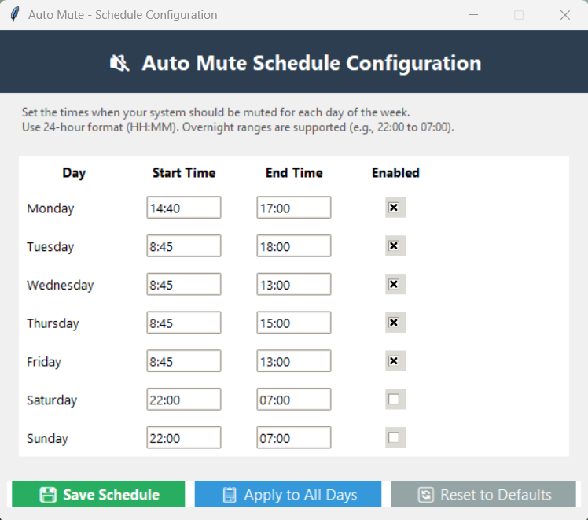

# Auto Mute

A Python script that automatically mutes/unmutes your Windows system audio based on a customizable schedule.


## Features

- **Automatic muting** based on time schedules
- **Different schedules** for each day of the week
- **Overnight ranges** supported (e.g., 22:00 to 07:00)
- **Desktop notifications** when mute state changes
- **Runs silently** in the background
- **Global Hotkey**: `Ctrl+Shift+M` to toggle auto-mute ON/OFF
- **GUI Configuration Tool** for easy schedule setup
- **Auto-start on Windows login**
- **Re-mutes automatically** if you manually unmute during scheduled hours
- **System Tray Icon** with visual status indicator (green=enabled, red=paused)

## Screenshots

### GUI Configuration Tool
Easy-to-use interface for configuring your mute schedule:



## Requirements

- Windows OS
- Python 3.8 or higher
- Administrator privileges (for audio control)

## Quick Start

### 1. Clone the Repository
```bash
git clone https://github.com/AndruTjalas1/Auto-Mute.git
cd Auto-Mute
```

### 2. Create Virtual Environment & Install Dependencies
```powershell
python -m venv .venv
.\.venv\Scripts\Activate.ps1
pip install -r requirements.txt
```

### 3. Configure Your Schedule

**Option A: Use the GUI (Recommended)**
```powershell
# Double-click configure_schedule.vbs
# OR run:
python config_gui.py
```

**Option B: Edit config.json manually**
```json
{
  "Monday": { "start": "22:00", "end": "07:00" },
  "Tuesday": { "start": "22:00", "end": "07:00" },
  "Wednesday": { "start": "22:00", "end": "07:00" },
  "Thursday": { "start": "22:00", "end": "07:00" },
  "Friday": { "start": "23:00", "end": "08:00" },
  "Saturday": { "start": "23:00", "end": "08:00" },
  "Sunday": { "start": "22:00", "end": "07:00" }
}
```

### 4. Run the Script

**Test Run (Console mode with output):**
```powershell
python auto_mute.py
```

**Background Mode with System Tray Icon (Recommended for testing):**
```powershell
python auto_mute.py --tray
```

**Silent Background Mode (One-time run):**
```powershell
# Double-click run_auto_mute.vbs
# OR run:
wscript run_auto_mute.vbs
```

### 5. Enable Persistent Auto-Start (Recommended)
For Auto-Mute to run automatically at Windows startup with watchdog protection:
```powershell
# Run with administrator privileges:
powershell -ExecutionPolicy Bypass -File setup_autostart.ps1
```

See the **Setup Auto-Start on Windows Login (Persistent Watchdog)** section below for detailed configuration.

## Setup Auto-Start on Windows Login (Persistent Watchdog)

Auto Mute uses a **watchdog mechanism** to keep the application running forever, even if it crashes or the system wakes from sleep. To set this up:

### Step 1: Create Virtual Environment
```powershell
python -m venv .venv
.\.venv\Scripts\Activate.ps1
pip install -r requirements.txt
```

### Step 2: Verify Python Path (Important!)
The watchdog script expects Python to be in the virtual environment at:
```
C:\Auto-Mute\.venv\Scripts\pythonw.exe
```

If you installed Python in a different location or your virtual environment is elsewhere, update these files:
- `restart_watchdog.bat` - Line 9: `set "PYTHON_EXE_PATH=..."`
- `setup_autostart.ps1` - Update the path to match your setup

### Step 3: Enable Auto-Start
```powershell
# Run the setup script with admin privileges:
powershell -ExecutionPolicy Bypass -File setup_autostart.ps1
```

This will:
- Create a scheduled task that runs `run_watchdog.vbs` at Windows startup
- The watchdog automatically launches the Auto-Mute process
- The watchdog monitors the process and restarts it if it crashes or the system wakes from sleep
- Logs activity to `watchdog.log` for debugging

### Step 4: Test the Setup
```powershell
# Verify the scheduled task was created:
Get-ScheduledTask -TaskName "Auto-Mute Watchdog" -ErrorAction SilentlyContinue

# Or manually start the watchdog:
wscript run_watchdog.vbs
```

### How the Watchdog Works
The watchdog system ensures Auto-Mute runs continuously:
1. **Scheduled Task** triggers `run_watchdog.vbs` at Windows startup
2. `run_watchdog.vbs` executes `restart_watchdog.bat`
3. `restart_watchdog.bat` starts the Python process and monitors it
4. If the process crashes, the watchdog restarts it automatically
5. If Windows wakes from sleep, the watchdog detects this and restarts the process
6. Activity is logged to `watchdog.log` for troubleshooting

## Hotkey Controls

**`Ctrl+Shift+M`** - Toggle Auto Mute ON/OFF

- **Enabled**: Schedule is enforced automatically
- **Paused**: Schedule temporarily disabled, manual audio control restored
- Works system-wide, even when other apps are focused

Perfect for when you need to deviate from your schedule temporarily!

## System Tray Icon

When running with `--tray` flag, a visual indicator appears in your taskbar:

- **Green Icon**: Auto-mute is ENABLED (schedule is active)
- **Red Icon**: Auto-mute is PAUSED (schedule is disabled)

**Right-click the icon for options:**
- Toggle Auto-Mute (enable/pause)
- Show Status (current state and time)
- Exit (close the application)

The icon updates automatically when you use the hotkey or when the schedule changes the mute state.

## Available Scripts

| Script | Description |
|--------|-------------|
| `auto_mute.py` | Main auto-mute script |
| `auto_mute_core.py` | Core logic for muting/unmuting and schedule management |
| `config_gui.py` | GUI for configuring schedule |
| `task_bar_icon.py` | System tray icon implementation |
| `run_auto_mute.vbs` | Run script silently in background (one-time) |
| `run_watchdog.vbs` | Launch watchdog for persistent background execution |
| `restart_watchdog.bat` | Watchdog monitoring script - restarts Auto-Mute if it crashes |
| `configure_schedule.vbs` | Open configuration GUI |
| `setup_autostart.ps1` | Add watchdog to Windows startup (recommended) |
| `remove_autostart.ps1` | Remove watchdog from Windows startup |
| `stop_auto_mute.ps1` | Stop running background process |
| `check_status.ps1` | Check if script is running |
| `watchdog.log` | Log file for watchdog activity and debugging |

## How It Works

### Main Application Flow
1. Script checks current time every minute
2. Compares against configured schedule for the current day
3. If current time is within mute range → mutes system
4. When time exits mute range → unmutes system
5. Notifications appear when mute state changes
6. If you manually unmute during mute hours, script re-mutes within 1 minute
7. Hotkey (`Ctrl+Shift+M`) allows manual toggling of auto-mute on/off

### Watchdog/Persistence Layer (When Auto-Started)
- **Scheduled Task** runs `run_watchdog.vbs` at Windows startup
- **Watchdog Batch Script** (`restart_watchdog.bat`) continuously monitors the Python process
- **Automatic Restart**: If the Auto-Mute process crashes or is killed, watchdog restarts it within 30 seconds
- **Sleep/Wake Handling**: Detects when system wakes from sleep and restarts the process to ensure continued functionality
- **Logging**: All watchdog activity is logged to `watchdog.log` for troubleshooting

## Use Cases

- **Quiet hours**: Prevent accidental audio during sleep hours
- **Work schedule**: Auto-mute during meetings or focus time
- **Shared spaces**: Respect quiet hours in shared living spaces
- **Gaming schedule**: Different schedules for weekdays vs weekends

## Dependencies

- `pycaw` - Windows audio control
- `comtypes` - COM interface support
- `plyer` - Cross-platform notifications
- `schedule` - Job scheduling
- `keyboard` - Global hotkey support
- `pystray` - System tray icon (optional, for `--tray` mode)
- `Pillow` - Image processing for tray icon (optional, for `--tray` mode)

All dependencies are listed in `requirements.txt`.

**To install tray icon dependencies:**
```powershell
pip install pystray Pillow
# Or use the installer script:
.\install_tray_dependencies.ps1
```

## Troubleshooting

**Script not starting with watchdog?**
- Verify virtual environment path is correct: `C:\Auto-Mute\.venv\Scripts\pythonw.exe`
- Check `watchdog.log` for error messages
- Ensure scheduled task was created: `Get-ScheduledTask -TaskName "Auto-Mute Watchdog"`
- Run `setup_autostart.ps1` again with administrator privileges

**Watchdog not restarting the process?**
- Check `watchdog.log` for error messages: `tail -f watchdog.log` (or open in notepad)
- Verify the process isn't blocked by Windows Defender or antivirus
- Ensure `restart_watchdog.bat` has correct Python path (line 9)

**Notifications not appearing?**
- Enable Windows notifications for Python
- Check Windows notification settings

**Script not muting?**
- Verify time format is "HH:MM" (24-hour format)
- Check day names match exactly (e.g., "Monday", not "monday")
- Run in console mode to see error messages: `python auto_mute.py`

**Can't stop background process?**
- Run `stop_auto_mute.ps1`
- Or use Task Manager to kill `pythonw.exe` process
- To remove from autostart: `powershell -ExecutionPolicy Bypass -File remove_autostart.ps1`

**Hotkey not working?**
- Ensure script is running: `powershell -ExecutionPolicy Bypass -File check_status.ps1`
- Check no other application is using `Ctrl+Shift+M`
- May require running as administrator

**Python not found errors?**
- Verify Python is installed and in PATH: `python --version`
- Or use full path to Python: `C:\Auto-Mute\.venv\Scripts\python.exe auto_mute.py`

## Contributing

Contributions are welcome! Please feel free to submit a Pull Request.

1. Fork the repository
2. Create your feature branch (`git checkout -b feature/AmazingFeature`)
3. Commit your changes (`git commit -m 'Add some AmazingFeature'`)
4. Push to the branch (`git push origin feature/AmazingFeature`)
5. Open a Pull Request

## License

This project is licensed under the MIT License - see the [LICENSE](LICENSE) file for details.

## Acknowledgments

- [pycaw](https://github.com/AndreMiras/pycaw) - Windows audio control library
- [plyer](https://github.com/kivy/plyer) - Cross-platform notification support
- [schedule](https://github.com/dbader/schedule) - Job scheduling library
- [keyboard](https://github.com/boppreh/keyboard) - Global hotkey support

## Contact

Andru Tjalas - [@AndruTjalas1](https://github.com/AndruTjalas1)

Project Link: [https://github.com/AndruTjalas1/Auto-Mute](https://github.com/AndruTjalas1/Auto-Mute)

---

If you find this project useful, please consider giving it a star!
